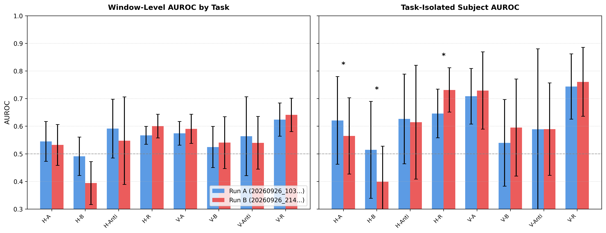
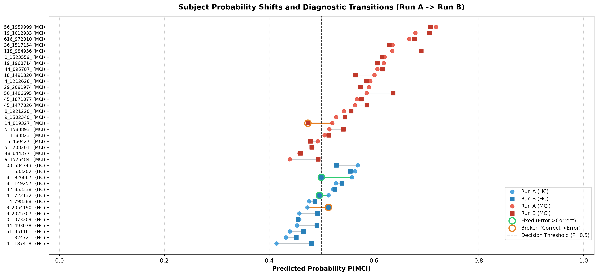

# Comparative Ablation Analysis: Run A vs Run B
- **Run A (Reference)**: `20260926_103636_full_pat015_wvote_artifact30_w0-5-5-10-0-15-15-30_strat_4err`
  - Source: `C:\Users\user.LAPTOP-M31S3OSQ\mci\outputs\checkpoints\run_20260926_103636_full_pat015_wvote_artifact30_w0-5-5-10-0-15-15-30_strat_4err\window_probs.csv`
- **Run B (Experimental)**: `20260926_214030_full_pat015_wvote_artifact30_w0-5-5-10-0-15-15-30_strat_4err_nocwtbl`
  - Source: `C:\Users\user.LAPTOP-M31S3OSQ\mci\outputs\checkpoints\run_20260926_214030_full_pat015_wvote_artifact30_w0-5-5-10-0-15-15-30_strat_4err_nocwtbl\window_probs.csv`
- **Evaluation Protocol**: 15-Fold Stratified Monte-Carlo Cross Validation (37 Subjects Total)
- **Subject Aggregation Weights**: `{"0": 0.0, "1": 0.5, "2": 0.5, "3": 1.0, "4": 0.0, "5": 1.5, "6": 1.5, "7": 3.0}`

## 1. Overall Performance and 15-Fold Paired Statistical Significance

| Metric | Run A (Mean ± SD) | Run B (Mean ± SD) | Δ (B - A) | Cohen's d | Paired t-test p | Wilcoxon p |
| :--- | :---: | :---: | :---: | :---: | :---: | :---: |
| **Window AUROC** | 0.5729 ± 0.0372 | 0.5750 ± 0.0451 | **+0.0021** | 0.098 | 0.7113 | 0.6387 |
| **Window Accuracy** | 0.5444 ± 0.0264 | 0.5470 ± 0.0367 | **+0.0026** | 0.111 | 0.6724 | 0.5509 |
| **Window Sensitivity** | 0.5161 ± 0.0598 | 0.5295 ± 0.0631 | **+0.0134** | 0.304 | 0.2593 | 0.3028 |
| **Window Specificity** | 0.5884 ± 0.0630 | 0.5744 ± 0.0483 | **-0.0140** | -0.362 | 0.1826 | 0.1094 |
| **Subject AUROC** | 0.8271 ± 0.1020 | 0.8583 ± 0.1013 | **+0.0312** | 0.370 | 0.1733 | 0.2060 |
| **Subject Accuracy** | 0.7167 ± 0.0850 | 0.7111 ± 0.0853 | **-0.0056** | -0.065 | 0.8062 | 0.6244 |
| **Subject Sensitivity** | 0.7833 ± 0.1795 | 0.8167 ± 0.1505 | **+0.0333** | 0.302 | 0.2620 | 0.2482 |
| **Subject Specificity** | 0.5833 ± 0.1972 | 0.5000 ± 0.2582 | **-0.0833** | -0.342 | 0.2071 | 0.1898 |

> *Note: Significance marker (*) denotes two-tailed p < 0.05.*

## 2. Granular 8-Task Dissection

Analysis of individual task performance across window-level classification and isolated subject-level soft voting.

| Task ID | Task Name | Weight | Win AUROC (Run A) | Win AUROC (Run B) | Win Δ | Subj AUROC (Run A) | Subj AUROC (Run B) | Subj Δ | Subj p-val |
| :---: | :--- | :---: | :---: | :---: | :---: | :---: | :---: | :---: | :---: |
| 0 | Task 0: Horizontal Saccade A | 0.0 | 0.5447 ± 0.0722 | 0.5320 ± 0.0741 | -0.0127 | 0.6208 ± 0.1589 | 0.5646 ± 0.1381 | **-0.0563** | 0.0411 * |
| 1 | Task 1: Horizontal Saccade B | 0.5 | 0.4908 ± 0.0695 | 0.3939 ± 0.0776 | -0.0969 | 0.5143 ± 0.1755 | 0.3988 ± 0.1287 | **-0.1155** | 0.0217 * |
| 2 | Task 2: Horizontal Saccade B (anti) | 0.5 | 0.5913 ± 0.1064 | 0.5476 ± 0.1586 | -0.0438 | 0.6263 ± 0.1625 | 0.6141 ± 0.2061 | **-0.0121** | 0.8557 |
| 3 | Task 3: Horizontal Saccade R | 1.0 | 0.5667 ± 0.0325 | 0.6002 ± 0.0428 | +0.0336 | 0.6458 ± 0.0881 | 0.7312 ± 0.0805 | **+0.0854** | 0.0274 * |
| 4 | Task 4: Vertical Saccade A | 0.0 | 0.5742 ± 0.0429 | 0.5903 ± 0.0530 | +0.0161 | 0.7083 ± 0.1006 | 0.7292 ± 0.1401 | **+0.0208** | 0.4568 |
| 5 | Task 5: Vertical Saccade B | 1.5 | 0.5244 ± 0.0745 | 0.5404 ± 0.0938 | +0.0159 | 0.5396 ± 0.1570 | 0.5949 ± 0.1759 | **+0.0554** | 0.2427 |
| 6 | Task 6: Vertical Saccade B (anti) | 1.5 | 0.5636 ± 0.1427 | 0.5397 ± 0.0956 | -0.0239 | 0.5888 ± 0.2911 | 0.5894 ± 0.1674 | **+0.0007** | 0.9918 |
| 7 | Task 7: Vertical Saccade R | 3.0 | 0.6239 ± 0.0601 | 0.6408 ± 0.0606 | +0.0169 | 0.7438 ± 0.1181 | 0.7604 ± 0.1248 | **+0.0167** | 0.5482 |

### Key Task Dissection Findings:
- **Top Positive Contributor Tasks**: Task 3: Horizontal Saccade R (+0.0854), Task 5: Vertical Saccade B (+0.0554), Task 4: Vertical Saccade A (+0.0208), Task 7: Vertical Saccade R (+0.0167), Task 6: Vertical Saccade B (anti) (+0.0007)
- **Negative/Degraded Tasks**: Task 2: Horizontal Saccade B (anti) (-0.0121), Task 0: Horizontal Saccade A (-0.0563), Task 1: Horizontal Saccade B (-0.1155)

## 3. 37-Subject Error Transitions and Diagnostic Shift

### 3.1 Transition Summary
- **Total Evaluated Subjects**: 37 (HC: 14, MCI: 23)
- **Fixed (Error → Correct)**: **2 subjects**
- **Broken (Correct → Error)**: **2 subjects**
- **Maintained Correct**: **25 subjects**
- **Maintained Error**: **8 subjects**
- **Net Subject Diagnostic Flip**: **+0 subjects**
- **Mean HC Probability Shift ΔP**: +0.0089 (target: < 0)
- **Mean MCI Probability Shift ΔP**: +0.0066 (target: > 0)
- **Mean Directional Margin Gain**: +0.0008

### 3.2 Flipped Subjects Detail

#### Fixed Subjects (Recovered from Misclassification):
| Subject ID | Class | Run A Prob (Cat) | Run B Prob (Cat) | ΔP | Transition |
| :--- | :---: | :---: | :---: | :---: | :---: |
| `20240627_083104_1722132_` | HC | 0.5133 (FP) | 0.4960 (TN) | -0.0172 | FP → TN |
| `20240830_103408_1926067_` | HC | 0.5579 (FP) | 0.4997 (TN) | -0.0582 | FP → TN |

#### Broken Subjects (New Misclassifications Introduced):
| Subject ID | Class | Run A Prob (Cat) | Run B Prob (Cat) | ΔP | Transition |
| :--- | :---: | :---: | :---: | :---: | :---: |
| `20240507_083503_2054190_` | HC | 0.4729 (TN) | 0.5132 (FP) | +0.0403 | TN → FP |
| `20250814_111814_819327_` | MCI | 0.5206 (TP) | 0.4740 (FN) | -0.0465 | TP → FN |

### 3.3 Full Subject Probability Shift Roster

| Subject ID | Class | Folds Tested | Run A P(MCI) | Run B P(MCI) | ΔP | Margin Gain | Cat A | Cat B | State |
| :--- | :---: | :---: | :---: | :---: | :---: | :---: | :---: | :---: | :---: |
| `20240416_133414_1187418_` | HC | 1 | 0.4140 | 0.4810 | +0.0669 | -0.0669 | TN | TN | Maintained Correct |
| `20240329_084111_1324721_` | HC | 4 | 0.4318 | 0.4519 | +0.0201 | -0.0201 | TN | TN | Maintained Correct |
| `20240830_093351_951161_` | HC | 6 | 0.4394 | 0.4654 | +0.0260 | -0.0260 | TN | TN | Maintained Correct |
| `20240329_101344_493078_` | HC | 3 | 0.4533 | 0.4911 | +0.0378 | -0.0378 | TN | TN | Maintained Correct |
| `20240329_094040_1073209_` | HC | 8 | 0.4573 | 0.4554 | -0.0019 | +0.0019 | TN | TN | Maintained Correct |
| `20240709_083459_2025307_` | HC | 3 | 0.4577 | 0.4926 | +0.0349 | -0.0349 | TN | TN | Maintained Correct |
| `20240507_083503_2054190_` | HC | 5 | 0.4729 | 0.5132 | +0.0403 | -0.0403 | TN | FP | Broken |
| `20240709_095414_798388_` | HC | 6 | 0.4765 | 0.4874 | +0.0109 | -0.0109 | TN | TN | Maintained Correct |
| `20240627_083104_1722132_` | HC | 3 | 0.5133 | 0.4960 | -0.0172 | +0.0172 | FP | TN | Fixed |
| `20241011_105132_853338_` | HC | 3 | 0.5223 | 0.5254 | +0.0031 | -0.0031 | FP | FP | Maintained Error |
| `20240705_102008_1149257_` | HC | 3 | 0.5273 | 0.5390 | +0.0116 | -0.0116 | FP | FP | Maintained Error |
| `20240830_103408_1926067_` | HC | 5 | 0.5579 | 0.4997 | -0.0582 | +0.0582 | FP | TN | Fixed |
| `20240613_084041_1533202_` | HC | 6 | 0.5642 | 0.5548 | -0.0093 | +0.0093 | FP | FP | Maintained Error |
| `20250612_100903_584743_` | HC | 4 | 0.5691 | 0.5284 | -0.0406 | +0.0406 | FP | FP | Maintained Error |
| `20251015_092729_1525484_` | MCI | 7 | 0.4394 | 0.4938 | +0.0544 | +0.0544 | FN | FN | Maintained Error |
| `20250701_091148_644377_` | MCI | 1 | 0.4580 | 0.4597 | +0.0017 | +0.0017 | FN | FN | Maintained Error |
| `20260120_085825_1208201_` | MCI | 10 | 0.4822 | 0.4814 | -0.0008 | -0.0008 | FN | FN | Maintained Error |
| `20251202_152715_460427_` | MCI | 6 | 0.4926 | 0.4789 | -0.0137 | -0.0137 | FN | FN | Maintained Error |
| `20250917_084851_1188823_` | MCI | 3 | 0.5057 | 0.5137 | +0.0080 | +0.0080 | TP | TP | Maintained Correct |
| `20251231_142955_1588893_` | MCI | 7 | 0.5148 | 0.5416 | +0.0268 | +0.0268 | TP | TP | Maintained Correct |
| `20250814_111814_819327_` | MCI | 2 | 0.5206 | 0.4740 | -0.0465 | -0.0465 | TP | FN | Broken |
| `20250826_085849_1502340_` | MCI | 4 | 0.5278 | 0.5448 | +0.0171 | +0.0171 | TP | TP | Maintained Correct |
| `20250910_083538_1921220_` | MCI | 9 | 0.5427 | 0.5564 | +0.0137 | +0.0137 | TP | TP | Maintained Correct |
| `20260127_134745_1477026` | MCI | 4 | 0.5640 | 0.5866 | +0.0226 | +0.0226 | TP | TP | Maintained Correct |
| `20260421_091245_1871077` | MCI | 7 | 0.5674 | 0.5759 | +0.0085 | +0.0085 | TP | TP | Maintained Correct |
| `20260225_142456_1486695` | MCI | 7 | 0.5861 | 0.6368 | +0.0507 | +0.0507 | TP | TP | Maintained Correct |
| `20260415_084829_2091974` | MCI | 6 | 0.5904 | 0.5745 | -0.0159 | -0.0159 | TP | TP | Maintained Correct |
| `20260224_093854_1212626_` | MCI | 3 | 0.5930 | 0.5861 | -0.0068 | -0.0068 | TP | TP | Maintained Correct |
| `20260325_084718_1491320` | MCI | 4 | 0.6010 | 0.5649 | -0.0361 | -0.0361 | TP | TP | Maintained Correct |
| `20251112_091044_895787_` | MCI | 6 | 0.6066 | 0.6167 | +0.0101 | +0.0101 | TP | TP | Maintained Correct |
| `20260204_134719_1968714` | MCI | 4 | 0.6187 | 0.6066 | -0.0121 | -0.0121 | TP | TP | Maintained Correct |
| `20251223_131850_1523559_` | MCI | 5 | 0.6203 | 0.6157 | -0.0046 | -0.0046 | TP | TP | Maintained Correct |
| `20260311_094118_984956` | MCI | 2 | 0.6347 | 0.6902 | +0.0555 | +0.0555 | TP | TP | Maintained Correct |
| `20260310_090536_1517154` | MCI | 4 | 0.6354 | 0.6293 | -0.0061 | -0.0061 | TP | TP | Maintained Correct |
| `20260128_084616_972310` | MCI | 7 | 0.6671 | 0.6773 | +0.0102 | +0.0102 | TP | TP | Maintained Correct |
| `20260317_093419_1012933` | MCI | 6 | 0.6791 | 0.7057 | +0.0266 | +0.0266 | TP | TP | Maintained Correct |
| `20260324_091656_1959999` | MCI | 6 | 0.7182 | 0.7080 | -0.0102 | -0.0102 | TP | TP | Maintained Correct |

## 4. Visualizations

### Figure 1: 8-Task Granular AUROC Comparison

### Figure 2: Subject Probability Shift and Transition Analysis

