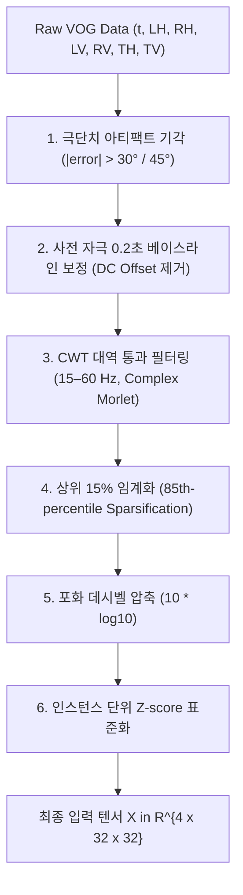

# 01. 전처리 및 입력 생성 단계의 노이즈 처리

본 문서는 원본 VOG 시계열 신호로부터 4채널 CWT 스칼로그램 입력 텐서 $\mathbf{X} \in \mathbb{R}^{4 \times 32 \times 32}$를 생성하기까지 적용된 노이즈 필터링 및 정규화 기법을 기술합니다.

---

## 1. 노이즈 처리 단계 요약

---

## 2. 세부 노이즈 처리 기법 및 수식

### 2.1 극단치 아티팩트 기각 (Artifact Rejection)

- **대상 노이즈**: 눈 깜빡임(Blink), 동공 추적 유실(Loss of tracking), 급격한 머리 움직임으로 인한 비생리학적 시선 튐 현상.
- **코드 위치**: [data_engineer.py](file:///c:/Users/USER/MCI-VOG/src/four_error_using/data_processor/data_engineer.py#L424-L426)
- **수학적 조건**:
  주 과제 축(Task-axis)의 좌안 및 우안 오차 신호 $e_{\text{task}, L}(t), e_{\text{task}, R}(t)$에 대해:
  $$\max_{t \in [-0.2, 0.8]} |e_{\text{task}, L}(t)| > \theta_{\text{artifact}} \quad \lor \quad \max_{t \in [-0.2, 0.8]} |e_{\text{task}, R}(t)| > \theta_{\text{artifact}} \implies \text{Drop Window}$$
  (기본 임계값: $\theta_{\text{artifact}} = 30.0^\circ$ 또는 $45.0^\circ$)
- **효과**: 생리학적 안구 운동 범위를 벗어나는 거대 노이즈 구간을 사전에 제거하여 왜곡된 윈도우가 학습 및 평가 데이터셋에 유입되는 것을 차단합니다.

---

### 2.2 사전 자극 구간 베이스라인 보정 (Pre-stimulus Baseline Correction)

- **대상 노이즈**: VOG 헤드셋의 미세 밀림(Slippage), 피험자 기저 사시(Strabismus), 캘리브레이션 오프셋 등으로 인한 직류(DC) 표류(Baseline Drift).
- **코드 위치**: [data_engineer.py](file:///c:/Users/USER/MCI-VOG/src/four_error_using/data_processor/data_engineer.py#L416-L417)
- **수학적 수식**:
  자극 제시 직전 $0.2\,\text{s}$ 구간 ($N_{\text{pre}} = \lfloor 0.2 \cdot f_s \rfloor$ 샘플)의 평균을 산출하여 1.0초 윈도우 전체에서 감산:
  $$\mu_{\text{pre}, c} = \frac{1}{N_{\text{pre}}} \sum_{k=1}^{N_{\text{pre}}} e_c(t_k)$$
  $$\bar{e}_c(t) = e_c(t) - \mu_{\text{pre}, c}, \quad \forall t \in [-0.2, 0.8]\,\text{s}$$
- **효과**: 시도(Trial)마다 변동하는 초기 시선 위치의 영점 오프셋을 $0$으로 일치시켜 순수한 자극 유발 반응만을 분리합니다.

---

### 2.3 CWT 주파수 대역 통과 필터링 ($15\text{–}60\,\text{Hz}$)

- **대상 노이즈**:
  1. $15\,\text{Hz}$ 이하: 안구의 거시적 시선 이동(Macro-saccadic displacement) 및 저주파 안구 표류(Slow drift).
  2. $60\,\text{Hz}$ 이상: 나이퀴스트 주파수($f_s / 2 = 60\,\text{Hz}$) 초과 에일리어싱(Aliasing) 및 전원선 잡음.
- **코드 위치**: [data_engineer.py](file:///c:/Users/USER/MCI-VOG/src/four_error_using/data_processor/data_engineer.py#L97-L99)
- **수학적 수식**:
  복소 모체 웨이블릿 $\psi(t) = \pi^{-1/4} e^{i 2\pi f_0 t} e^{-t^2/2}$ ($f_0 = 1.0\,\text{Hz}$)를 사용하여 $15\,\text{Hz}$부터 $60\,\text{Hz}$까지 $F=32$개 로그 등간격 주파수 $f_k$에서만 연속 웨이블릿 변환 수행:
  $$f_k = 10^{\log_{10}(15) + \frac{k}{31} (\log_{10}(60) - \log_{10}(15))}, \quad a_k = \frac{f_0 \cdot f_s}{f_k}$$
  $$C_c(f_k, \tau) = \frac{1}{\sqrt{a_k}} \int \bar{e}_c(t) \psi^*\left(\frac{t - \tau}{a_k}\right) dt$$
- **효과**: 저주파 궤적 에너지를 하드 고역 통과(Hard High-pass)시켜 거시적 변위를 배제하고, 안구 미세 진전(Tremor) 및 급격한 가속/감속 과도 성분만 격리합니다.

---

### 2.4 상위 15% 임계화 (85th-percentile Sparsification)

- **대상 노이즈**: 웨이블릿 변환 계수 전반에 잔존하는 기저 백색 잡음(Background ambient noise) 및 미세 잔류 진동.
- **코드 위치**: [data_engineer.py](file:///c:/Users/USER/MCI-VOG/src/four_error_using/data_processor/data_engineer.py#L180-L185)
- **수학적 수식**:
  $$M_c(f, t) = |C_c(f, t)| = \sqrt{\text{Re}(C_c)^2 + \text{Im}(C_c)^2}$$
  $$\theta_{85, c} = \text{Percentile}(M_c, 85)$$
  $$\tilde{M}_c(f, t) = \begin{cases} M_c(f, t), & M_c(f, t) \ge \theta_{85, c} \\ 10^{-3}, & M_c(f, t) < \theta_{85, c} \end{cases}$$
- **효과**: 에너지 상위 15%에 해당하는 주 새케이드 전이 에지만 남기고 하위 85%의 배경 계수를 $10^{-3}$ 상수로 절단하여 에지 강조형 희소(Sparse) 텐서를 구성합니다.

---

### 2.5 포화 데시벨 변환 및 Z-score 표준화

- **대상 노이즈**: 피험자 및 시도 간 절대 신호 진폭(Magnitude scale) 편차.
- **코드 위치**: [data_engineer.py](file:///c:/Users/USER/MCI-VOG/src/four_error_using/data_processor/data_engineer.py#L186-L188)
- **수학적 수식**:
  $$S_c(f, t) = 10 \log_{10} \tilde{M}_c(f, t)$$
  $$Z_c(f, t) = \frac{S_c(f, t) - \mu_S}{\sigma_S + 10^{-8}}$$
- **효과**: 지수적으로 분포하는 웨이블릿 크기를 로그 스케일로 압축하고 단일 윈도우 기준 평균 0, 분산 1로 정규화하여 극단적 진폭 차이에 의한 가중치 왜곡을 차단합니다.

---

## 3. 한계점 및 비판적 분석

1. **상위 15% 하드 임계화에 따른 미세 진전(Tremor) 정보 유실**:
   - $85\%$의 계수를 일괄 절단하면 저진폭의 고주파 병적 신호(MCI 환자의 미세 주시 떨림 등)가 배경 노이즈와 함께 소거될 위험이 존재합니다.
2. **사전 $0.2\,\text{s}$ 고정 베이스라인에 의한 병적 주시 결손 상쇄**:
   - MCI 환자에게 빈번한 사각파 저크(Square-wave jerks) 등 주시 불안정성이 사전 $0.2\,\text{s}$에 발생할 경우, 병적 이상치가 베이스라인 평균 $\mu_{\text{pre}}$로 흡수되어 오히려 정상화(Over-correction)되는 문제가 발생합니다.
3. **고정 아티팩트 임계값($30^\circ/45^\circ$)의 임의성**:
   - 임계값이 데이터 기반 최적화 없이 정적으로 설정되어 있으며, 타깃 진폭이 큰 과제와 작은 과제 간의 기각 비율 편차가 발생합니다.

---

## 4. 개선 대안

- **웨이블릿 소프트 임계화(Wavelet Soft-Thresholding)**: 85% 분위수 하드 절단 대신 Donoho의 유니버설 소프트 임계값($\lambda = \sigma \sqrt{2 \ln N}$)을 적용하여 연속성 유지 *(Donoho, 1995)*.
- **적응형 주시 검출 베이스라인**: 속도 임계값 기반(I-VT)으로 안구가 실제로 정지한 구간만을 선별하여 베이스라인을 추정.
