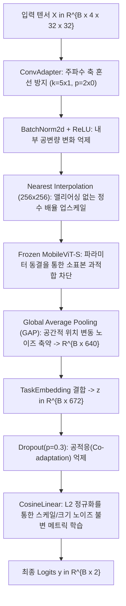

# 02. 신경망 아키텍처 및 특징 표현 단계의 노이즈 억제

본 문서는 입력 텐서 $\mathbf{X} \in \mathbb{R}^{B \times 4 \times 32 \times 32}$가 신경망 계층을 통과하며 특징 벡터로 변환되고 최종 분류 로짓(Logit)을 산출할 때까지 적용되는 노이즈 억제 및 정규화 기법을 기술합니다.

---

## 1. 계층별 노이즈 억제 흐름

---

## 2. 세부 메커니즘 및 수식

### 2.1 비대칭 공간 어댑터 (`ConvAdapter`)의 주파수 혼선 차단

- **대상 노이즈**: 2D 합성곱 시 인접 주파수 대역 간의 간섭 및 블러링(Frequency Crosstalk / Blurring).
- **코드 위치**: [conv_adapter.py](file:///c:/Users/USER/MCI-VOG/src/four_error_using/models/layers/conv_adapter.py#L13-L17)
- **수학적 수식**:
  $$\mathbf{U}_{b, c, i, j} = \sum_{k=0}^{3} \sum_{m=-2}^{2} \mathbf{X}_{b, k, i+m, j} \cdot \mathbf{W}_{c, k, m+2, 0}^{\text{adapt}} + b_c$$
  $$\mathbf{X}_{\text{adapt}} = \max\left(0, \frac{\mathbf{U} - \mu_{\text{BN}}}{\sqrt{\sigma_{\text{BN}}^2 + \epsilon}} \cdot \gamma + \beta\right)$$
- **효과**:
  - 커널 크기 $(5, 1)$, 패딩 $(2, 0)$을 적용하여 시간 축(높이 5)으로는 5개 시점의 연속적 전이를 미분 필터링하면서, **주파수 축(너비 1)으로는 커널 폭이 1이므로 이웃 주파수 빈과의 혼선 없이 32개 주파수 대역의 해상도를 온전히 보존**합니다.

---

### 2.2 동결 백본 (`FrozenMobileViTBackbone`)과 전역 평균 풀링 (GAP)

- **대상 노이즈**: 37명 소표본 데이터에서 4.94M 규모의 심층 파라미터 학습 시 발생하는 치명적 과적합(Overfitting).
- **코드 위치**: [frozen_mobilevit_backbone.py](file:///c:/Users/USER/MCI-VOG/src/four_error_using/models/layers/frozen_mobilevit_backbone.py#L33-L45)
- **수학적 수식**:
  $$\nabla_{\theta_{\text{backbone}}} \mathcal{L} = \mathbf{0} \quad (\text{requires\_grad = False})$$
  $$\mathbf{h}_{\text{vision}}(b, c) = \frac{1}{64} \sum_{h=1}^{8} \sum_{w=1}^{8} \mathbf{F}_{\text{last}}(b, c, h, w) \in \mathbb{R}^{B \times 640}$$
- **효과**:
  - ImageNet으로 사전 학습된 가중치를 완전히 고정하여 소표본 암기(Memorization)를 차단하고, 최종 $8 \times 8$ 공간 특징 맵을 GAP로 평균화하여 **미세한 시간 지연이나 공간적 위치 편차(Misalignment)에 불변한 640차원 표현**을 추출합니다.

---

### 2.3 코사인 선형 분류 헤드 (`CosineLinear`)의 스케일 노이즈 불변성

- **대상 노이즈**: 신호 진폭이나 피험자별 특징 벡터의 노름(Norm/Magnitude) 편차로 인한 분류 경계 왜곡.
- **코드 위치**: [cosine_linear.py](file:///c:/Users/USER/MCI-VOG/src/four_error_using/models/layers/cosine_linear.py#L20-L22)
- **수학적 수식**:
  결합 특징 벡터 $\tilde{\mathbf{z}} \in \mathbb{R}^{B \times 672}$ 및 클래스 프로토타입 $\mathbf{w}_c \in \mathbb{R}^{672}$ ($c \in \{0, 1\}$)에 대해:
  $$\hat{\mathbf{z}} = \frac{\tilde{\mathbf{z}}}{\|\tilde{\mathbf{z}}\|_2}, \quad \hat{\mathbf{w}}_c = \frac{\mathbf{w}_c}{\|\mathbf{w}_c\|_2}$$
  $$y_c = s \cdot (\hat{\mathbf{z}}^\top \hat{\mathbf{w}}_c) = s \cdot \cos(\theta_c), \quad s = 10.0$$
- **효과**:
  - 표준 선형 계층($\mathbf{w}^\top \mathbf{z} + b$)과 달리 편향(Bias)이 없고 벡터의 크기가 소거되어, **특징 벡터의 절대 크기(Scale)와 무관하게 클래스 프로토타입과의 각도(Angle/Cosine similarity)만을 기반으로 판정**합니다. 극단적 이상치 벡터가 출력 로짓을 왜곡하는 현상을 방지합니다.

---

### 2.4 데이터 증강 노이즈 (`AugmentedSubset` - SpecAugment)

- **대상 노이즈**: 특정 시간대나 특정 주파수 대역에 편향되어 과적합되는 현상 방지.
- **코드 위치**: [data_engineer.py](file:///c:/Users/USER/MCI-VOG/src/four_error_using/data_processor/data_engineer.py#L836-L855)
- **수학적 수식**:
  훈련 단계에서 확률 $p = 0.5$로 무작위 밴드 마스킹 적용:
  - 주파수 마스킹: $f \in [1, 8]$, $f_0 \in [0, 32 - f] \implies \mathbf{X}_{:, f_0 : f_0 + f, :} = 0$
  - 시간 마스킹: $t \in [1, 8]$, $t_0 \in [0, 32 - t] \implies \mathbf{X}_{:, :, t_0 : t_0 + t} = 0$
- **효과**: 학습 중 일부 주파수나 시간 구간이 결손되어도 다른 신호 단서를 바탕으로 분류하도록 강제하여 모델의 강건성(Robustness)을 향상시킵니다 *(Park et al., 2019)*.

---

## 3. 한계점 및 비판적 분석

1. **사전 학습 도메인 불일치 (Domain Shift)**:
   - MobileViT 백본은 자연 이미지(ImageNet-1k)로 사전 학습된 모델이므로, CWT 시간-주파수 스칼로그램이 갖는 물리적 위상 및 물리 대역 특성과 도메인 간 격차가 큽니다. 백본이 고정되어 있어 생체 신호 고유의 잡음 특성에 적응하지 못합니다.
2. **SpecAugment에 의한 핵심 전이 신호 손실 위험**:
   - 시간 축 32개 빈 중 최대 8개 빈(25%)을 0으로 지우면, 약 $30\text{–}80\,\text{ms}$ 동안만 짧게 발생하는 핵심 새케이드 개시(Onset) 신호 자체가 완전히 마스킹되어 잘못된 레이블 학습을 유발할 수 있습니다.
3. **고정 스케일 파라미터 ($s = 10.0$)의 제약**:
   - 코사인 분류기의 스케일 $s$는 소프트맥스 확률 분포의 샤프니스(Sharpness/Temperature)를 결정하는데, 10.0으로 고정되어 있어 엔트로피 조절이 제한됩니다.

---

## 4. 참고 문헌
- Park, D. S., et al. (2019). "SpecAugment: A simple data augmentation method for automatic speech recognition." *Interspeech*, 2613-2617.
- Wang, H., et al. (2018). "CosFace: Large margin cosine loss for deep face recognition." *CVPR*, 5265-5274.
