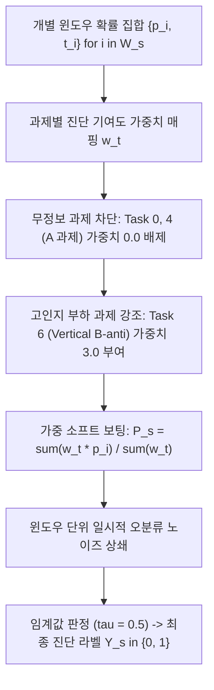

# 03. 추론 집계 및 의사결정 단계의 노이즈 완화

본 문서는 모델이 산출한 개별 윈도우 단위 확률 $p_i = P(\text{MCI} \mid \mathbf{X}_i, t_i)$로부터 최종 피험자 단위 진단 판정 $\hat{Y}_s \in \{0, 1\}$을 도출할 때 적용되는 노이즈 완화 및 통계적 집계 기법을 기술합니다.

---

## 1. 의사결정 노이즈 완화 흐름

---

## 2. 세부 메커니즘 및 수식

### 2.1 무정보 과제 차단 및 과제별 가중 투표 (Task-Weighted Soft Vote)

- **대상 노이즈**:
  1. 인지 결손 변별력이 부족한 단순 반사 과제(Task 0, 4: Horizontal/Vertical Saccade A)가 최종 진단에 미치는 희석(Dilution) 노이즈.
  2. 과제 난이도 차이에 따른 예측 신뢰도 불균형.
- **코드 위치**: [repetitive_validator.py](file:///c:/Users/USER/MCI-VOG/src/four_error_using/evaluators/repetitive_validator.py#L112-L126)
- **수학적 수식**:
  피험자 $s$의 유효 윈도우 집합 $\mathcal{W}_s = \{1, 2, \dots, M_s\}$에 대해:
  $$\mathbf{w}_{\text{vote}} = [w_0, w_1, w_2, w_3, w_4, w_5, w_6, w_7] = [0.0, \, 0.0, \, 0.0, \, 1.5, \, 0.0, \, 1.5, \, 3.0, \, 2.5]$$
  $$P_s = \frac{\sum_{i \in \mathcal{W}_s} w_{t_i} \cdot p_i}{\sum_{i \in \mathcal{W}_s} w_{t_i}}$$
- **효과**:
  - 임상적으로 유의미한 신호를 제공하지 못하는 단순 과제의 윈도우는 $w_{t_i} = 0.0$으로 처리되어 합산 분모/분자에서 완전히 배제됩니다.
  - 전두엽 억제 제어 부하가 높은 수직 안티새케이드 과제(Task 6)에 가장 높은 가중치($3.0$)를 부여하여 신호 대 잡음비(SNR)를 극대화합니다.

---

### 2.2 윈도우 단위 오분류 상쇄 (Averaging Out Window-level Noise)

- **대상 노이즈**:
  - 환자의 순간적 주의 분산, 일시적 눈 깜빡임 잔여 오차, 개별 1초 윈도우에서의 거짓 양성(False Positive) 및 거짓 음성(False Negative) 오분류.
- **통계적 원리**:
  피험자 $s$당 약 $80\text{–}120$개의 유효 윈도우가 생성됩니다. 각 윈도우의 예측 확률 $p_i$가 참 확률 $P_s^*$ 주변에서 평균 0, 분산 $\sigma_{\text{win}}^2$의 독립적 오차 $\epsilon_i$를 가진다고 가정할 때:
  $$p_i = P_s^* + \epsilon_i, \quad \mathbb{E}[\epsilon_i] = 0, \quad \text{Var}(\epsilon_i) = \sigma_{\text{win}}^2$$
  가중 평균을 적용한 피험자 단위 확률 $P_s$의 분산은 표본 수 $M_s$에 반비례하여 급격히 감소합니다:
  $$\text{Var}(P_s) \approx \frac{\sum w_{t_i}^2}{\left(\sum w_{t_i}\right)^2} \sigma_{\text{win}}^2 \ll \sigma_{\text{win}}^2$$
- **효과**: 개별 윈도우 단위의 일시적 노이즈가 다수의 시도에 걸친 가중 평균을 통해 상쇄되어 피험자 단위 진단의 안정성이 확보됩니다.

---

### 2.3 제로 분모(Zero-denominator) 폴백 안전장치

- **대상 노이즈**: 아티팩트 기각 등으로 인해 피험자에게 가중치가 부여된 과제(Task 3, 5, 6, 7)의 유효 윈도우가 하나도 남지 않아 발생하는 나눗셈 오류($\sum w_{t_i} = 0$).
- **코드 위치**: [repetitive_validator.py](file:///c:/Users/USER/MCI-VOG/src/four_error_using/evaluators/repetitive_validator.py#L123-L125)
- **수학적 수식**:
  $$\text{If } \sum_{i \in \mathcal{W}_s} w_{t_i} \le 0: \quad P_s = \frac{1}{M_s} \sum_{i \in \mathcal{W}_s} p_i$$
- **효과**: 예외 상황 발생 시 단순 산술 평균으로 자동 대체하여 파이프라인의 연산 무결성을 유지합니다.

---

## 3. 한계점 및 비판적 분석

1. **학습 손실과 추론 가중치의 불일치 (Train-Inference Objective Mismatch)**:
   - 추론 시에는 Task 0, 4의 가중치를 0으로 배제하지만, 모델 학습 단계에서는 이들 과제의 윈도우도 동일한 교차 엔트로피 손실($w=1.0$)로 역전파되어 모델 가중치 갱신에 관여합니다. 즉, 최종 평가에 쓰이지 않는 신호가 학습 자원을 소모합니다.
2. **이상치 윈도우에 대한 가중 산술 평균의 취약성**:
   - 가중 평균(Weighted mean)은 극단적인 이상치(예: 노이즈로 인해 $p_i \approx 0.99$로 잘못 예측된 단 1개의 윈도우)에 취약합니다. 중위수(Median)나 분위수 기반 집계 대비 이상치 저항성이 낮습니다.
3. **고정 가중치 $\mathbf{w}_{\text{vote}}$의 경험적 휴리스틱 한계**:
   - 가중치 벡터 $[0, 0, 0, 1.5, 0, 1.5, 3.0, 2.5]$는 탐색 실험(Probe analysis)을 통해 사후적으로 고정된 값이며, 피험자 개인의 과제별 데이터 품질이나 불확실성(Uncertainty)을 동적으로 반영하지 못합니다.

---

## 4. 개선 대안

- **학습 목적 함수 정렬 (Task-Weighted Loss)**: 훈련 단계의 손실 함수에 추론 가중치 $w_t$를 표본 가중치로 직접 적용.
- **불확실성 기반 베이지안 집계 (Uncertainty-Weighted Aggregation)**: 모델의 예측 엔트로피 또는 몬테카를로 드롭아웃 분산 $\sigma_i^2$을 추정하여 불확실성이 큰 윈도우의 투표 반영 비중을 낮춤 *(Kendall & Gal, 2017)*.
- **다중 인스턴스 어텐션 풀링 (Attention-based MIL)**: 휴리스틱 가중치 대신 어텐션 네트워크가 인스턴스 신뢰도 가중치를 엔드투엔드로 학습 *(Ilse et al., 2018)*.

---

## 5. 참고 문헌
- Kendall, A., & Gal, Y. (2017). "What uncertainties do we need in bayesian deep learning for computer vision?" *Advances in Neural Information Processing Systems (NeurIPS)*, 30, 5574-5584.
- Ilse, M., Tomczak, J. M., & Welling, M. (2018). "Attention-based Deep Multiple Instance Learning." *ICML*, PMLR 80:2127-2136.
