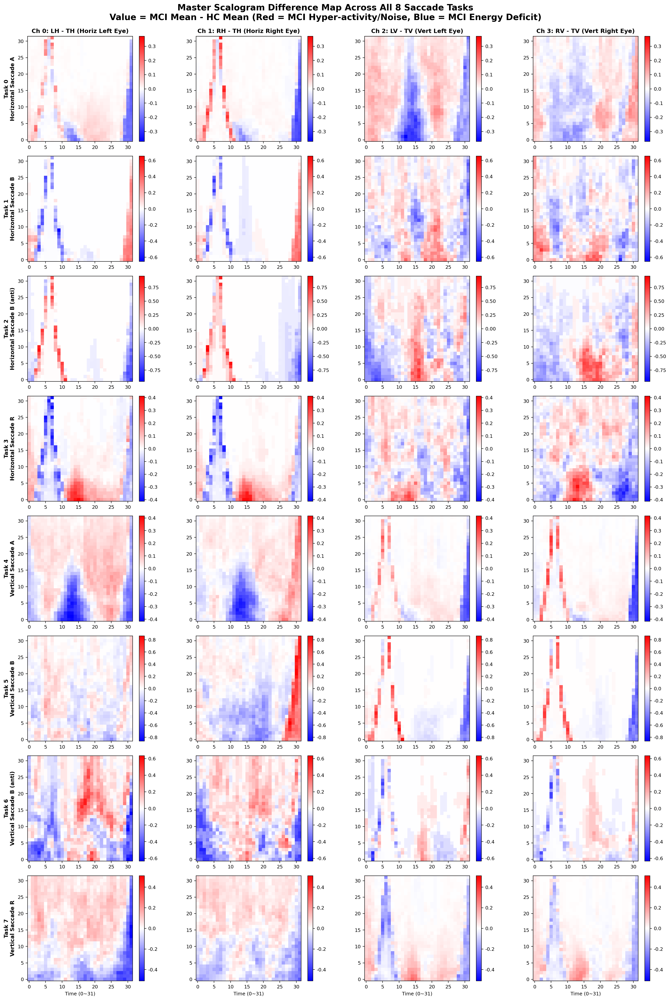
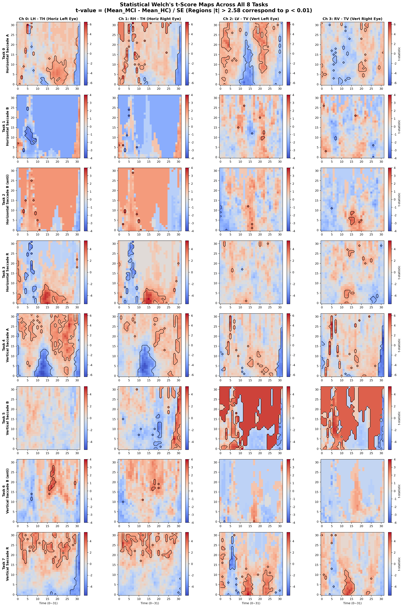
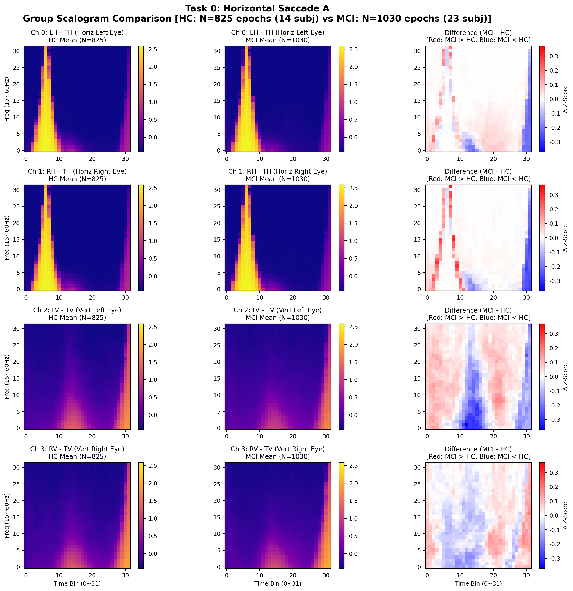
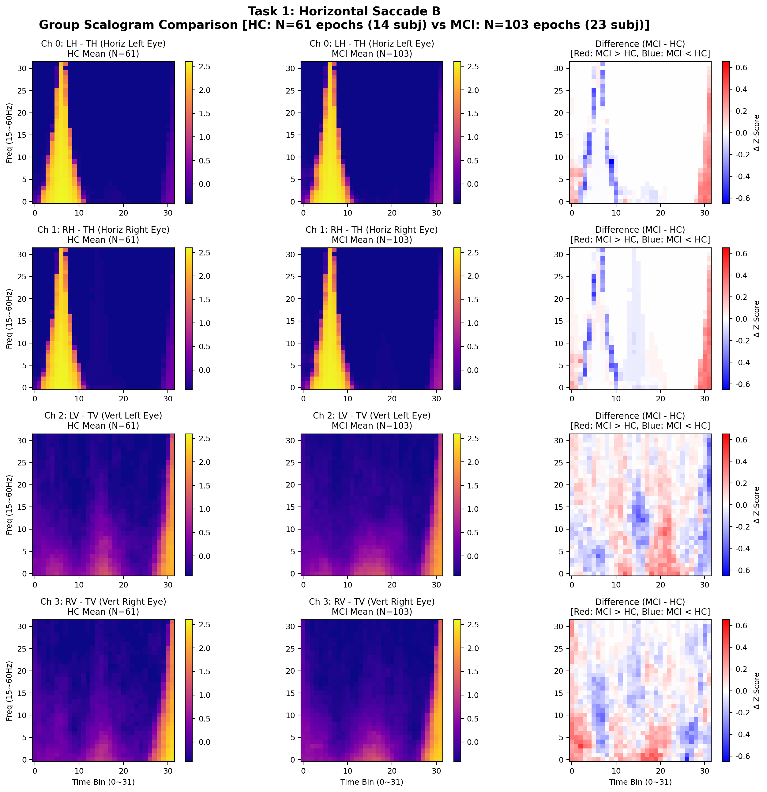
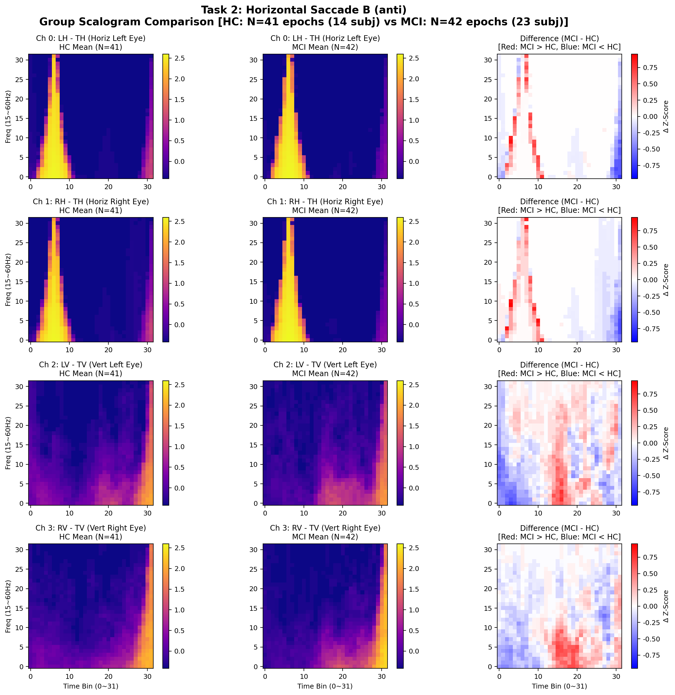
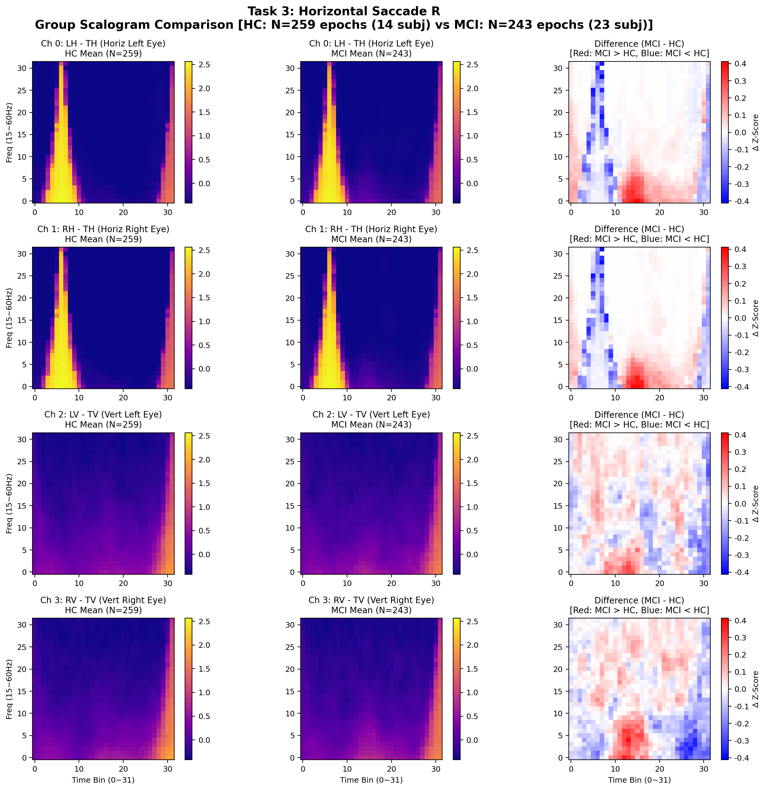
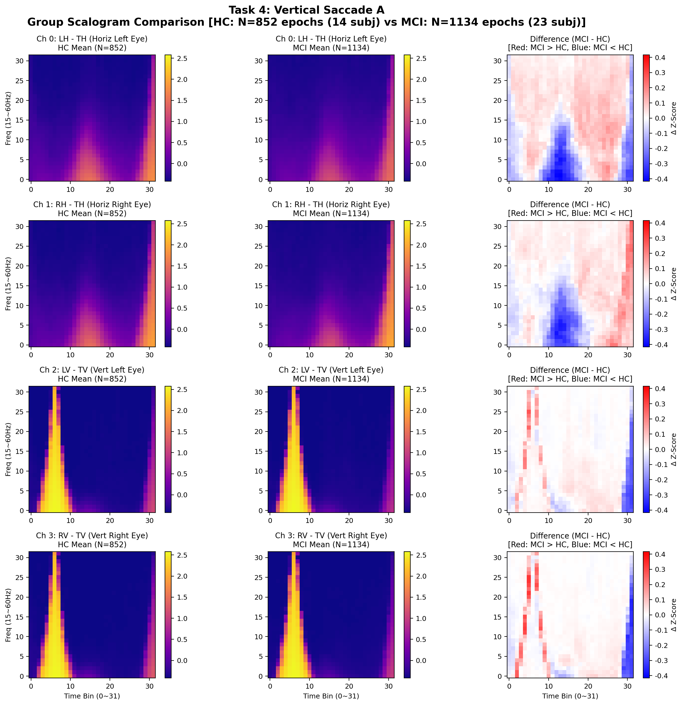
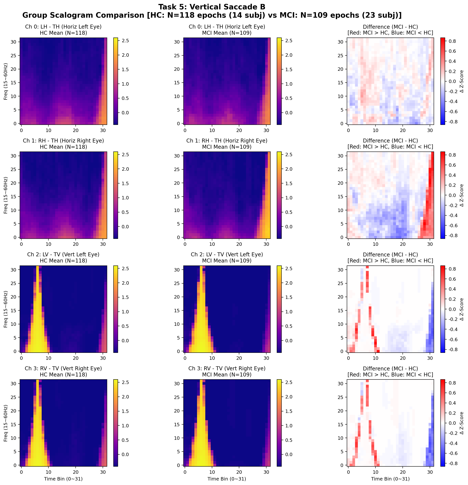
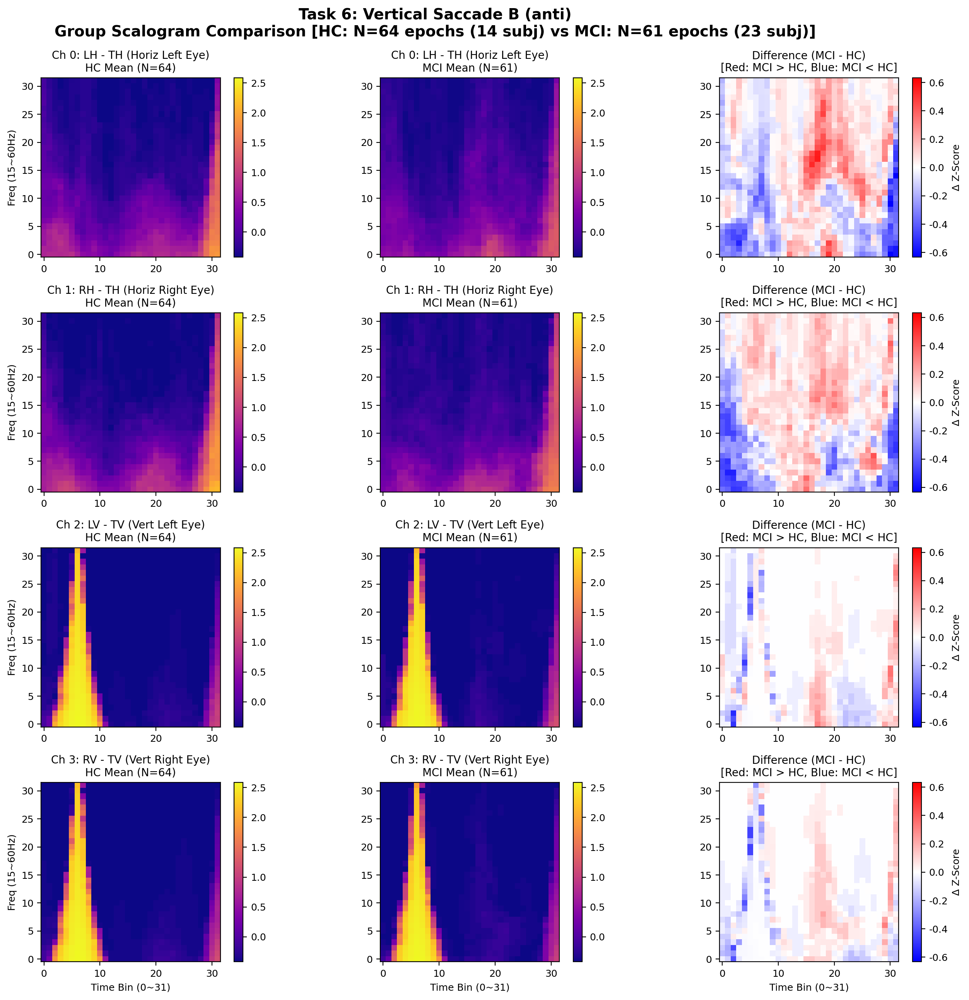
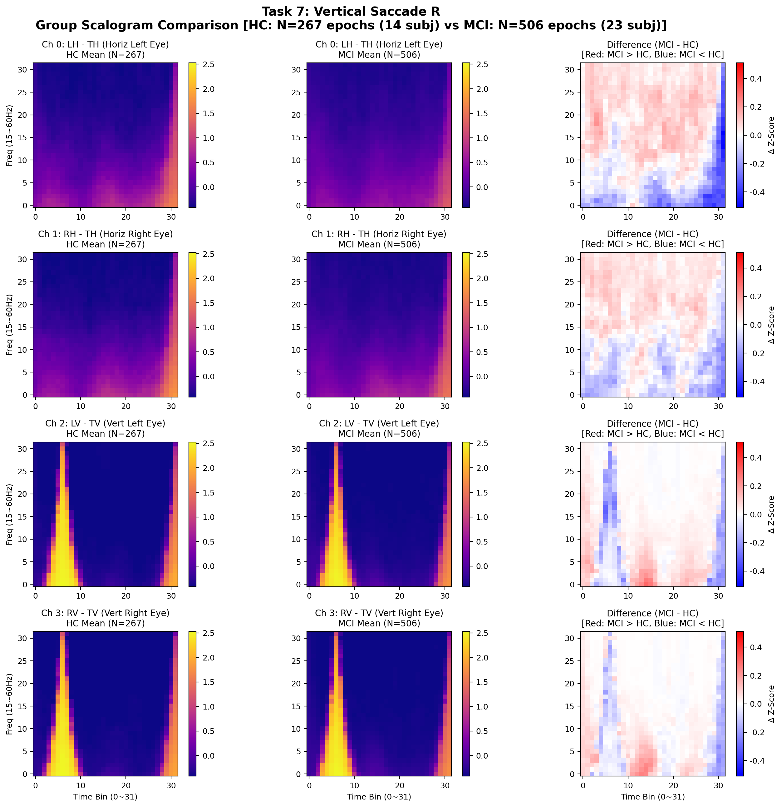

# 8개 검사 과제 및 4채널 군별(HC vs MCI) 평균·차이·통계 분석 보고서

본 문서는 37명 전체 연구 코호트(HC 14명, MCI 23명)의 총 5,715개 유효 윈도우 텐서를 전수 집계하여, **8개 사카드 검사 과제(Task 0~7)** 및 **4개 안구 오차 채널(LH, RH, LV, RV)** 각각에 대한 **HC 군 평균**, **MCI 군 평균**, **차이 맵($\Delta = \text{MCI} - \text{HC}$)** 및 **Welch's $t$-검정 통계 유의성 맵**을 도출한 분석 결과입니다.

---

## 1. 전체 코호트 에포크(윈도우) 분포

| 과제 ID | 검사 과제 명칭 (Task Name) | 정상군 HC 윈도우 수 ($N_{\text{HC}}$) | 환자군 MCI 윈도우 수 ($N_{\text{MCI}}$) | 총합 윈도우 수 |
|:---:|:---|:---:|:---:|:---:|
| **Task 0** | Horizontal Saccade A | 825 | 1,030 | 1,855 |
| **Task 1** | Horizontal Saccade B | 61 | 103 | 164 |
| **Task 2** | Horizontal Saccade B (anti) | 41 | 42 | 83 |
| **Task 3** | Horizontal Saccade R | 259 | 243 | 502 |
| **Task 4** | Vertical Saccade A | 852 | 1,134 | 1,986 |
| **Task 5** | Vertical Saccade B | 118 | 109 | 227 |
| **Task 6** | Vertical Saccade B (anti) | 64 | 61 | 125 |
| **Task 7** | Vertical Saccade R | 267 | 506 | 773 |
| **전체 합계** | **8개 검사 과제** | **2,487 윈도우 (14명)** | **3,228 윈도우 (23명)** | **5,715 윈도우** |

---

## 2. 마스터 대시보드 (8 Tasks $\times$ 4 Channels = 32 Panels)

### 2.1 전 과제 차이 맵 ($\Delta = \text{MCI} - \text{HC}$)
- **해석**: 빨간색(Red)은 MCI 환자의 스펙트럼 에너지가 정상군보다 높은 영역(Hyper-activity / Noise / Overshoot), 파란색(Blue)은 정상군 대비 에너지가 결핍된 영역을 나타냅니다.

### 2.2 통계적 유의성 맵 (Welch's $t$-Score, $p < 0.01$ 윤곽선)
- **해석**: 픽셀별 독립 $t$-통계량 맵입니다. 검은색 실선 윤곽선(Contour)은 $|t| > 2.58$ ($p < 0.01$, 신뢰수준 99%)을 만족하는 통계적 유의 차이 영역입니다.

---

## 3. 검사 과제별 상세 4채널 비교 패널 (Task 0 ~ Task 7)

### Task 0: Horizontal Saccade A

### Task 1: Horizontal Saccade B

### Task 2: Horizontal Saccade B (anti)

### Task 3: Horizontal Saccade R

### Task 4: Vertical Saccade A

### Task 5: Vertical Saccade B

### Task 6: Vertical Saccade B (anti)

### Task 7: Vertical Saccade R

