# VOG 원본 신호부터 스칼로그램 및 모델 입력 텐서 변환 14단계 시각화

본 문서는 실제 환자 VOG 원본 CSV 데이터(`안미영_PD VOG -_Horizontal Saccade B (anti).csv`)를 `data_engineer.py` 및 모델 어댑터 레이어의 실제 파이프라인 함수에 통과시키면서, 각 단계를 거친 직후의 데이터 형상(Shape)과 물리적 형태의 변화를 단계별로 시각화한 분석 보고서입니다.

---

## 1. 전체 파이프라인 파노라마 흐름 (Master Summary)

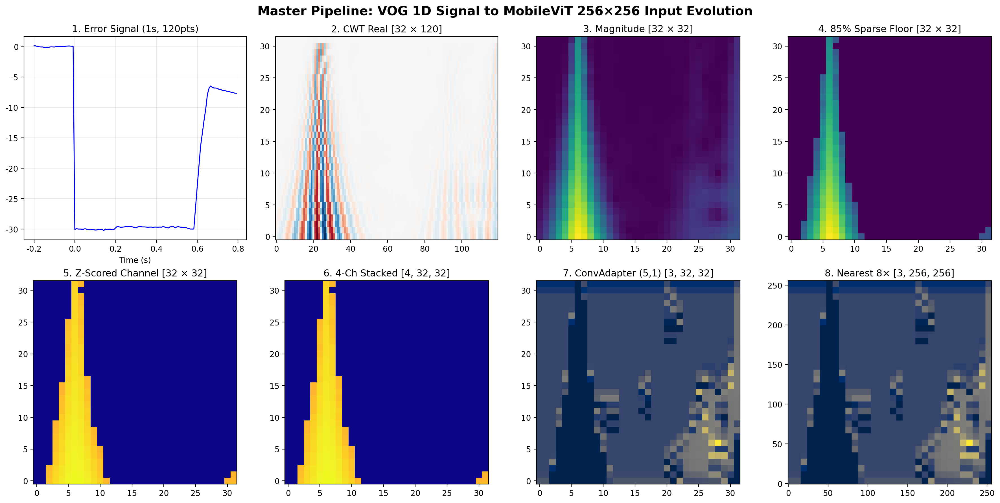

---

## 2. 단계별 데이터 형태 변화 및 시각화 상세

### Step 01: 원본 CSV 시계열 로딩 (Raw Time-Series)
- **데이터 형상**: $N \approx 3{,}600 \sim 7{,}200$ 행, 7개 컬럼 (`Time(sec)`, `LH`, `RH`, `LV`, `RV`, `TargetH`, `TargetV`)
- **특성**: 평균 샘플링 주파수 $f_s \approx 120.0\text{ Hz}$ ($\Delta t \approx 8.33\text{ ms}$). 안구 좌표와 자극 타깃의 연속 궤적.
- **저장 파일**: `01_raw_csv_time_series.png`

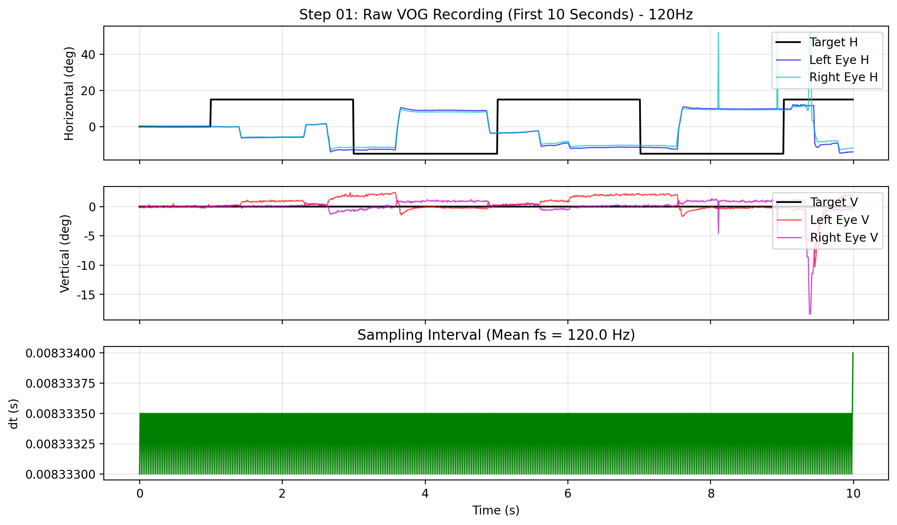

---

### Step 02: 안티사코드 타깃 반전 (Target Inversion)
- **수식**: $\text{target}(t) \leftarrow \text{target}(t) \times (-1)$ (Task ID 2, 6 적용)
- **특성**: 자극 지점의 반대 방향으로 시선을 옮겨야 하는 안티사코드 규칙에 따라 정답 타깃 궤적이 원점 대칭으로 반전됨.
- **저장 파일**: `02_target_inversion.png`

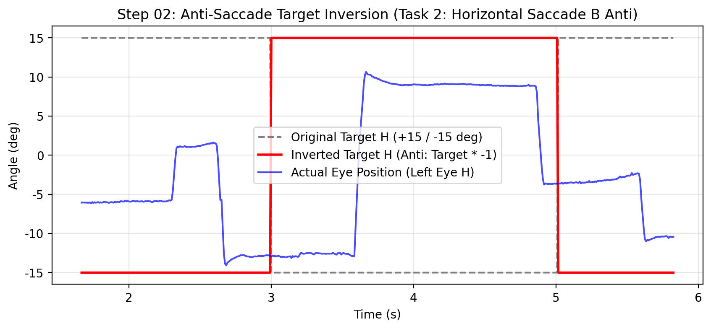

---

### Step 03: 1초 이벤트 윈도우 분할 (Event Window Extraction)
- **데이터 형상**: 타깃 변화 지점($t=0$) 기준 사전 $0.2\text{초}$ (24 샘플) + 사후 $0.8\text{초}$ (96 샘플) = 총 120 샘플 ($1.0\text{초}$)
- **저장 파일**: `03_event_window_extraction.png`

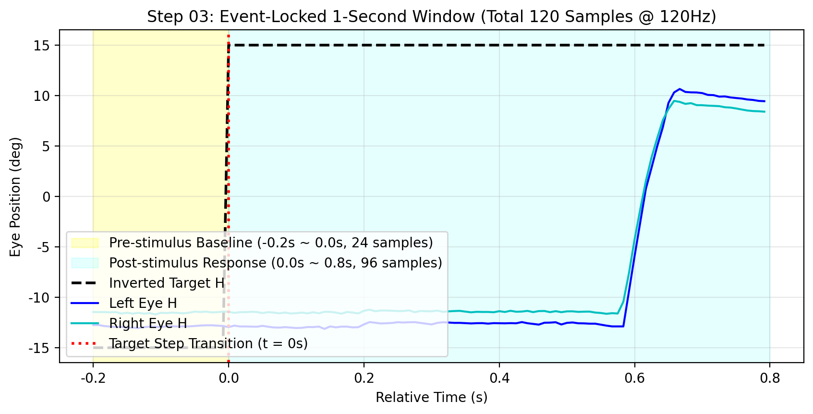

---

### Step 04: 오차 계산 및 베이스라인 감산 (Error & Baseline Correction)
- **수식**:
  $$\text{err}(t) = \text{eye}(t) - \text{target}(t)$$
  $$\text{err}_{\text{corr}}(t) = \text{err}(t) - \frac{1}{24}\sum_{k=1}^{24} \text{err}(t_k)$$
- **특성**: 자극 전 200ms 구간의 평균 위치 편차(오프셋)를 0으로 강제 보정.
- **저장 파일**: `04_error_baseline_correction.png`

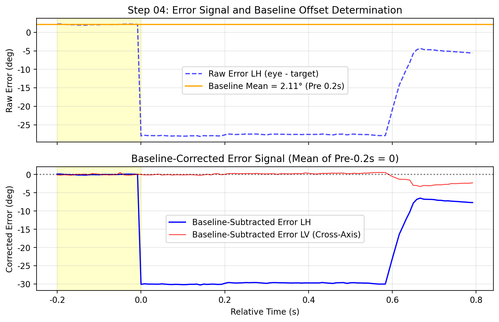

---

### Step 05: 아티팩트 기각 검사 (Artifact Rejection Check)
- **조건**: $\max |\text{task\_err}| \le 30.0^\circ$
- **특성**: 최대 절대 오차가 $30^\circ$ 이내인 유효 윈도우만 통과. 초과 시 해당 1초 구간 전체 폐기.
- **저장 파일**: `05_artifact_check.png`

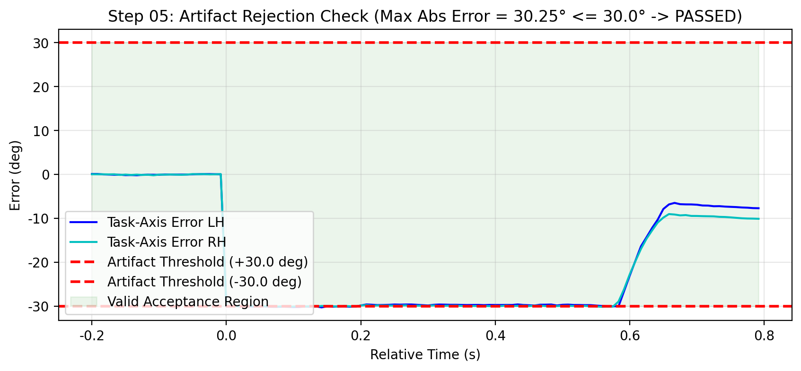

---

### Step 06: 연속 웨이블릿 변환 (CWT)
- **수식**: `pywt.cwt(err, scales, 'cmor4.0-1.0')` ($15 \sim 60\text{ Hz}$, 32개 로그 스케일)
- **데이터 형상**: 복소수 2D 배열 $[32, 120]$ (실수부 Real, 허수부 Imag)
- **저장 파일**: `06_cwt_complex_maps.png`

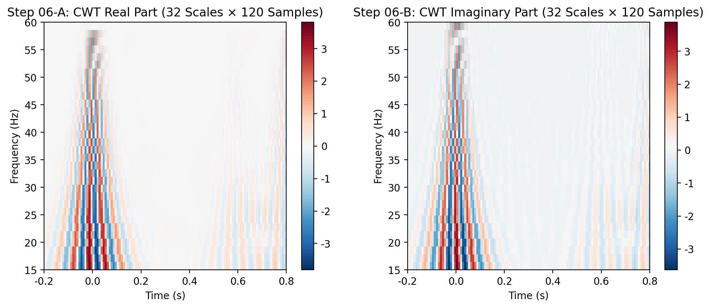

---

### Step 07: 시간 축 최근접 축소 (Nearest Resizing)
- **수식**: `zoom(..., (1.0, 32/120), mode='nearest', order=0)`
- **데이터 형상**: $[32, 120] \to [32, 32]$ 복소수 배열
- **특성**: 120개 시간 샘플을 32개 빈으로 압축하면서 0차 최근접 이웃(Nearest) 보간 적용.
- **저장 파일**: `07_time_zoom_nearest_32x32.png`

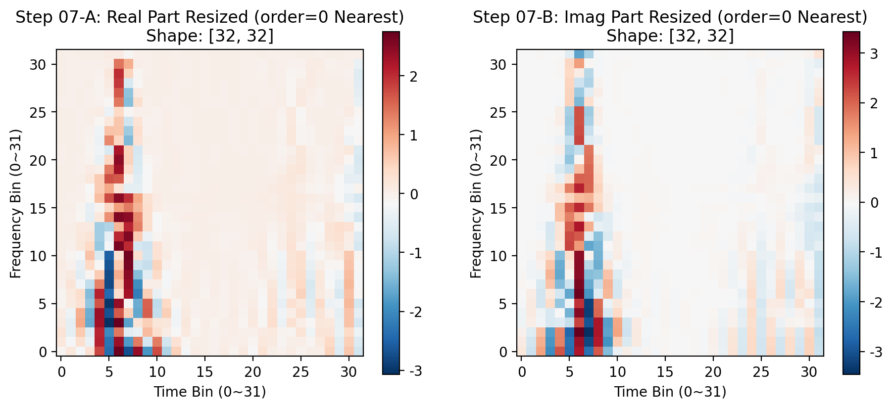

---

### Step 08: 진폭 산출 (Magnitude Extraction)
- **수식**: $M = \sqrt{\text{Re}^2 + \text{Im}^2}$
- **데이터 형상**: $[32, 32]$ 실수 맵
- **특성**: 복소 평면의 모듈러스를 계산하여 순시 진폭(Instantaneous Envelope) 도출.
- **저장 파일**: `08_magnitude_extraction.png`

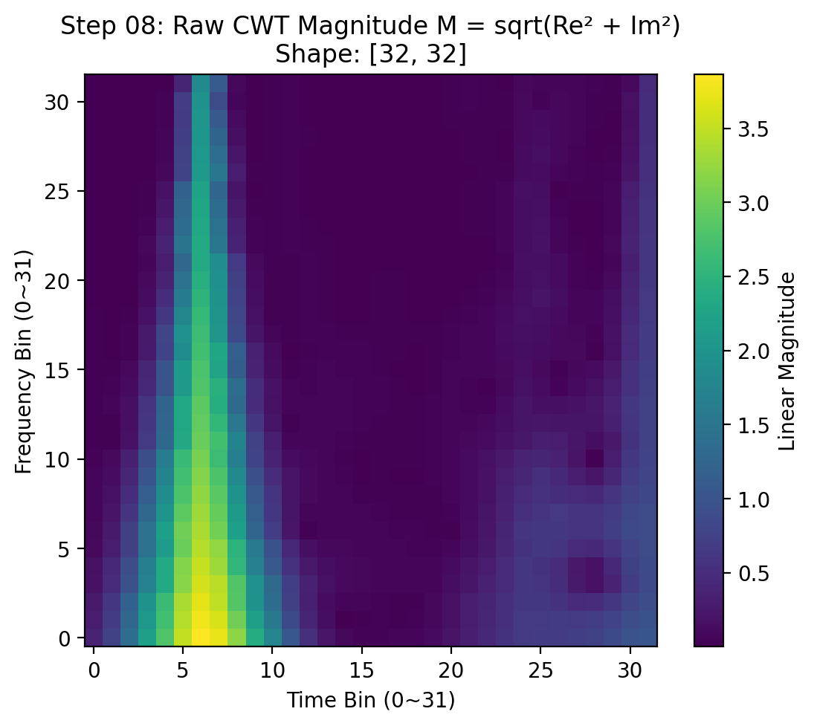

---

### Step 09: 상위 15% 희소화 (85th Percentile Hard Sparsification)
- **수식**:
  $$p_{85} = \text{percentile}(M, 85), \quad M[M < p_{85}] = 10^{-3}$$
- **특성**: 1024개 픽셀 중 하위 870개 픽셀(85%)을 일괄 $10^{-3}$ 상수로 평탄화.
- **저장 파일**: `09_85th_percentile_sparsification.png`

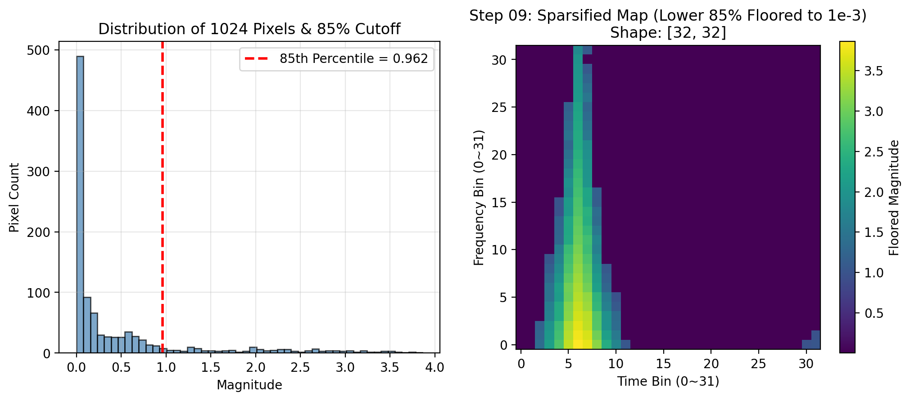

---

### Step 10: 데시벨 로그 변환 (Log-dB Transformation)
- **수식**: $S_{\text{dB}} = 10 \cdot \log_{10}(M)$
- **특성**: 하위 85%의 배경은 정확히 $-30.0\text{ dB}$로 고정.
- **저장 파일**: `10_log_db_transform.png`

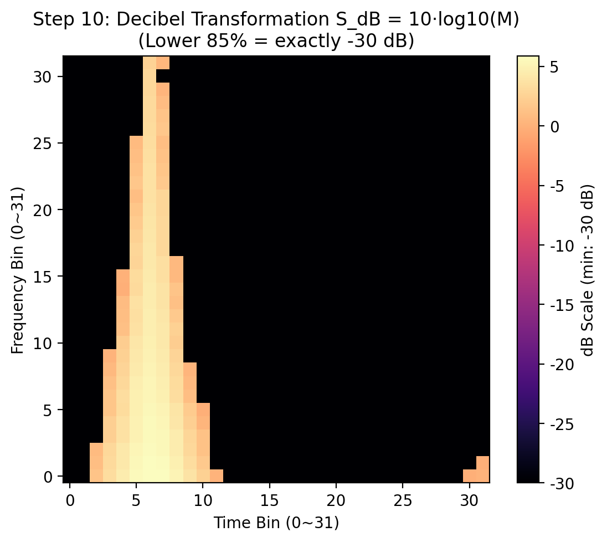

---

### Step 11: 윈도우 내 Z-Score 정규화 (Within-Window Normalization)
- **수식**: $Z = \frac{S_{\text{dB}} - \mu}{\sigma + 10^{-8}}$
- **특성**: 단일 윈도우/단일 채널 내부에서 강제 표준화($\mu=0, \sigma=1$). 85% 배경은 단일 스파이크(Dirac delta) 피크 형성.
- **저장 파일**: `11_z_score_normalization.png`

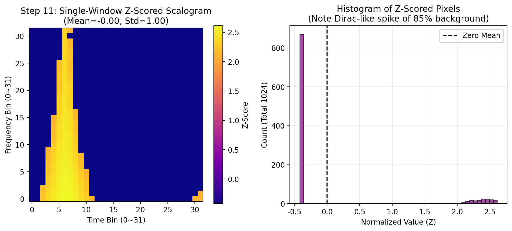

---

### Step 12: 4채널 결합 (4-Channel Tensor Stacking)
- **데이터 형상**: $\mathbf{X} \in \mathbb{R}^{4 \times 32 \times 32}$ (`[LH-TH, RH-TH, LV-TV, RV-TV]`)
- **특성**: 전처리 파이프라인의 최종 출력물이자 캐시(`data_store_full_4err.pkl`)에 저장되는 규격.
- **저장 파일**: `12_four_channel_tensor_stacking.png`

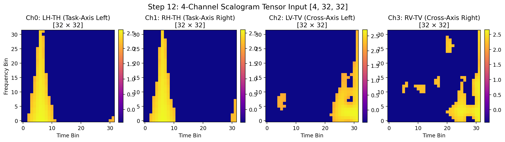

---

### Step 13: ConvAdapter 공간 변환 (Adapter Mapping)
- **수식**: `Conv2d(4, 3, kernel=(5, 1), pad=(2, 0)) + BatchNorm2d + ReLU`
- **데이터 형상**: $[4, 32, 32] \to [3, 32, 32]$
- **특성**: 4개 신호 채널을 ImageNet 3채널(RGB 규격)로 축소하고 주파수 축으로 5빈 에지 필터링.
- **저장 파일**: `13_conv_adapter_output.png`

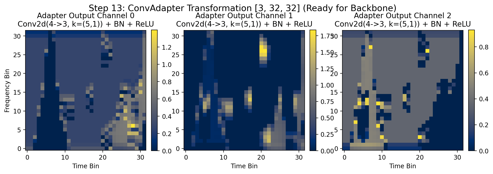

---

### Step 14: 8배 최근접 업스케일링 (Nearest 8x Upscaling)
- **수식**: `F.interpolate(x, size=(256, 256), mode='nearest')`
- **데이터 형상**: $[3, 32, 32] \to [3, 256, 256]$
- **특성**: Frozen MobileViT-S 백본의 고정 입력 해상도에 맞추기 위해 단일 픽셀이 $8 \times 8$ 체커보드 사각형 블록으로 복제됨.
- **저장 파일**: `14_nearest_8x_upscale_256x256.png`

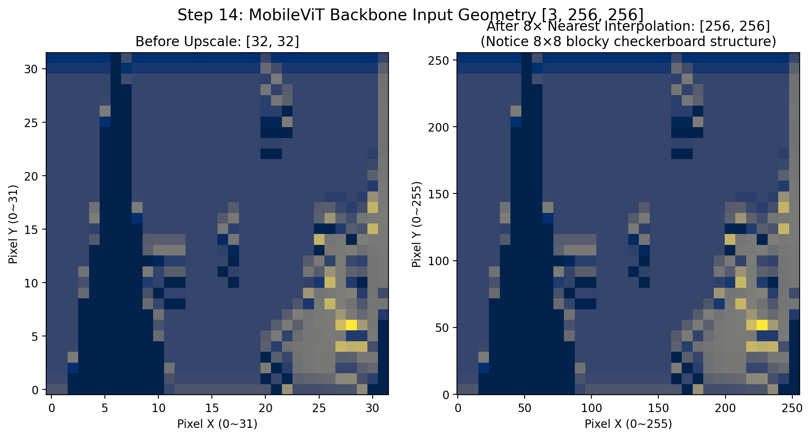
