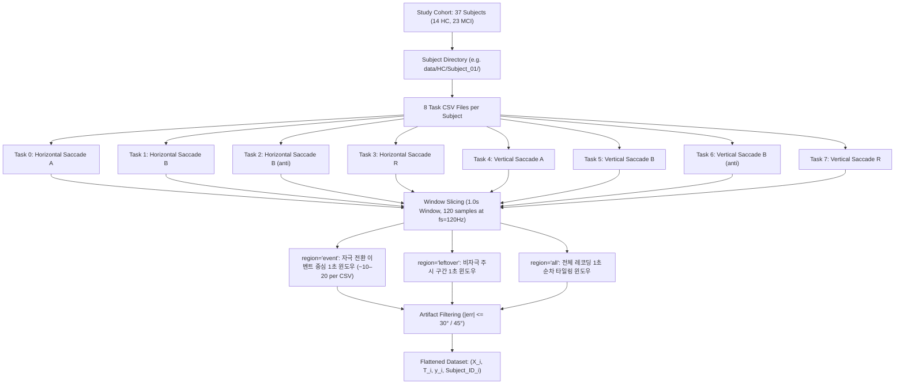

# 윈도우(Window) 및 태스크(Task)의 공학적 정의 및 데이터 계층 구조

본 문서는 VOG(Video Oculography) 시선 추적 원본 데이터로부터 피험자(Subject), 검사 과제(Task), 윈도우(Window)가 어떻게 정의되고 계층적으로 추출되는지, 그리고 3가지 `region` 모드(`event`, `leftover`, `all`)의 분할 알고리즘을 상세 수식 및 코드와 함께 기술합니다.

---

## 1. 데이터 계층 구조 (Data Hierarchy)

---

## 2. 태스크(Task)의 정의 및 매핑 로직

참조 코드: [data_engineer.py](file:///c:/Users/USER/MCI-VOG/src/four_error_using/data_processor/data_engineer.py#L101-L111), [L730-L743](file:///c:/Users/USER/MCI-VOG/src/four_error_using/data_processor/data_engineer.py#L730-L743)

### 2.1 태스크 식별자 매핑 테이블

피험자당 8종류의 VOG 검사 파일이 수집되며, 파일명 파싱 규칙(`filepath.stem.replace("PD VOG -_", "").replace("PD VOG -", "").strip()`)을 통해 0부터 7까지의 정수 인덱스 $t \in \{0, 1, \dots, 7\}$로 매핑됩니다.

| Task ID ($t$) | 과제명 (Clean Task Name) | 주 과제 축 (Task Axis) | 직교 축 (Other Axis) | 자극 특징 및 인지적 요구 |
|:---:|---|:---:|:---:|---|
| **0** | `Horizontal Saccade A` | Horizontal (H) | Vertical (V) | 단순 수평 시각 유도 새케이드 (고정 진폭) |
| **1** | `Horizontal Saccade B` | Horizontal (H) | Vertical (V) | 수평 새케이드 (가변 진폭/랜덤 위치) |
| **2** | `Horizontal Saccade B (anti)` | Horizontal (H) | Vertical (V) | **수평 안티새케이드**: 자극 반대 방향 주시 (전두엽 억제 제어) |
| **3** | `Horizontal Saccade R` | Horizontal (H) | Vertical (V) | 수평 반사적/무작위 새케이드 |
| **4** | `Vertical Saccade A` | Vertical (V) | Horizontal (H) | 단순 수직 시각 유도 새케이드 (고정 진폭) |
| **5** | `Vertical Saccade B` | Vertical (V) | Horizontal (H) | 수직 새케이드 (가변 진폭/랜덤 위치) |
| **6** | `Vertical Saccade B (anti)` | Vertical (V) | Horizontal (H) | **수직 안티새케이드**: 수직 반대 방향 주시 (고차 피질 억제 제어) |
| **7** | `Vertical Saccade R` | Vertical (V) | Horizontal (H) | 수직 반사적/무작위 새케이드 |

---

### 2.2 CSV 파일 컬럼 구조 및 동적 축 매핑

1. **입력 CSV 필수 컬럼**:
   - 시간 축: `time` 또는 `t` $\implies$ 샘플링 주기 $\Delta t = \text{mean}(\text{diff}(t))$, 샘플링 주파수 $f_s = \frac{1}{\Delta t} \approx 120\,\text{Hz}$
   - 좌안 좌표: `lh` (Left Horizontal), `lv` (Left Vertical)
   - 우안 좌표: `rh` (Right Horizontal), `rv` (Right Vertical)
   - 목표물 좌표: `targeth` ($TH$), `targetv` ($TV$)

2. **주 과제 축(Task-axis)과 직교 축(Other-axis)의 분리**:
   과제명에 `Horizontal`이 포함되면 $\text{axis\_char} = \text{'h'}$, `Vertical`이 포함되면 $\text{axis\_char} = \text{'v'}$로 지정됩니다:
   - $\text{axis\_char} == \text{'h'}$인 경우:
     $$l_{\text{tax}} = lh, \quad r_{\text{tax}} = rh, \quad target_{\text{tax}} = TH$$
     $$l_{\text{oax}} = lv, \quad r_{\text{oax}} = rv, \quad target_{\text{oax}} = TV$$
   - $\text{axis\_char} == \text{'v'}$인 경우:
     $$l_{\text{tax}} = lv, \quad r_{\text{tax}} = rv, \quad target_{\text{tax}} = TV$$
     $$l_{\text{oax}} = lh, \quad r_{\text{oax}} = rh, \quad target_{\text{oax}} = TH$$

3. **안티새케이드 조건의 목표 좌표 반전**:
   파일명에 `"anti"` 문자열이 포함된 과제(Task 2, 6)의 경우, 주 과제 축 목표 좌표를 부호 반전하여 인지적 목표 위치를 재정의합니다:
   $$\text{If } \text{is\_anti}: \quad target_{\text{tax}}(t) \leftarrow -target_{\text{tax}}(t)$$

4. **4채널 오차 신호의 절대 축 매핑**:
   최종 4채널 CWT 입력 텐서 구성을 위해 주 과제 축과 무관하게 항상 $\{LH, RH, LV, RV\}$ 순서로 오차 벡터를 정렬합니다:
   $$e_{LH}(t) = lh(t) - TH(t), \quad e_{RH}(t) = rh(t) - TH(t)$$
   $$e_{LV}(t) = lv(t) - TV(t), \quad e_{RV}(t) = rv(t) - TV(t)$$

---

## 3. 윈도우(Window)의 분할 알고리즘 (3가지 Region 모드)

참조 코드: [data_engineer.py:L395-L426](file:///c:/Users/USER/MCI-VOG/src/four_error_using/data_processor/data_engineer.py#L395-L426) (`event`), [L508-L605](file:///c:/Users/USER/MCI-VOG/src/four_error_using/data_processor/data_engineer.py#L508-L605) (`leftover`), [L628-L701](file:///c:/Users/USER/MCI-VOG/src/four_error_using/data_processor/data_engineer.py#L628-L701) (`all`)

모든 모드에서 윈도우의 총 시간 길이는 **정확히 $1.0\,\text{s}$ ($win = 120\,\text{samples}$ at $120\,\text{Hz}$)**로 동일합니다.

### 3.1 Mode 1: `event` (기본 모드 — Event-Locked Windows)

시각 자극의 위치가 바뀌는 전이 시점을 포착하여 그 전후 1초를 추출하는 표준 분석 방식입니다.

1. **자극 전환 이벤트 인덱스 탐지**:
   주 과제 축 목표 신호 $target_{\text{tax}}$의 1차 이산 차분이 $0$이 아닌 시점을 이벤트 인덱스 집합 $\mathcal{E}$로 정의합니다:
   $$\mathcal{E} = \left\{ k \in \{1, \dots, N_{\text{total}}-1\} \;\middle|\; target_{\text{tax}}[k] - target_{\text{tax}}[k-1] \neq 0 \right\}$$
2. **윈도우 경계 산출**:
   각 이벤트 $k \in \mathcal{E}$에 대해 사전 자극 $0.2\,\text{s}$ ($N_{\text{pre}} = \lfloor 0.2 \cdot f_s \rfloor = 24$), 사후 자극 $0.8\,\text{s}$ ($N_{\text{post}} = \lfloor 0.8 \cdot f_s \rfloor = 96$) 구간을 설정합니다:
   $$s = k - N_{\text{pre}}, \quad e = k + N_{\text{post}} \quad (\text{총 길이 } e - s = 120)$$
   단, $s < 0$이거나 $e > N_{\text{total}}$인 레코딩 경계 구간은 유효하지 않으므로 제외합니다.
3. **베이스라인 보정 및 아티팩트 검증**:
   사전 $0.2\,\text{s}$ 구간의 평균을 각 오차 신호에서 감산한 후, 주 과제 축 오차의 최댓값이 임계값을 초과하면 해당 윈도우를 기각합니다:
   $$\max_{t \in [s, e]} |e_{\text{tax}, L}(t)| > \theta_{\text{artifact}} \quad \lor \quad \max_{t \in [s, e]} |e_{\text{tax}, R}(t)| > \theta_{\text{artifact}} \implies \text{Drop}$$
   (통과된 윈도우만 CWT 텐서 $[4, 32, 32]$로 변환)

---

### 3.2 Mode 2: `leftover` (여집합 모드 — Inter-saccade / Fixation Windows)

자극 전환 이벤트가 발생하지 않은 안정 주시(Fixation) 구간에서만 윈도우를 추출하여 비자극 기저 상태를 모델링하는 모드입니다.

1. **이벤트 점유 마스크 생성**:
   전체 레코딩 길이 $N_{\text{total}}$에 대해, 아티팩트를 통과하여 채택된 모든 `event` 윈도우 구간을 불리언 마스크로 표시합니다:
   $$\mathbf{U}[t] = \begin{cases} \text{True}, & \exists [s, e] \in \mathcal{W}_{\text{event}} \text{ s.t. } t \in [s, e) \\ \text{False}, & \text{otherwise} \end{cases}$$
2. **미사용 여집합 구간 추출**:
   $$\mathbf{F}[t] = \neg \mathbf{U}[t]$$
3. **비중첩 1초 윈도우 순차 패킹 (Non-overlapping Packing)**:
   인덱스 $i = 0$부터 탐색하며, 연속된 120개 샘플($1.0\,\text{s}$)이 모두 $\text{True}$인 구간을 윈도우로 등록하고 120샘플씩 건너뜁니다:
   $$\text{If } \bigwedge_{j=i}^{i+119} \mathbf{F}[j] == \text{True}: \quad [s, e] = [i, i+120], \quad i \leftarrow i + 120$$
   $$\text{Else}: \quad i \leftarrow i + 1$$
4. 동일하게 사전 $0.2\,\text{s}$ 평균 감산 및 아티팩트 임계값 필터링을 적용합니다.

---

### 3.3 Mode 3: `all` (연속 타일링 모드 — Continuous Tiling Windows)

자극 이벤트 유무와 무관하게 레코딩 전체를 처음부터 끝까지 1초 간격으로 순차 분할하는 모드입니다.

1. **순차 타일링 슬라이싱**:
   $$s_m = m \cdot win, \quad e_m = (m+1) \cdot win \quad (win = 120, \ m \in \{0, 1, \dots, \lfloor N_{\text{total}} / win \rfloor - 1\})$$
2. 자극 전이 구간과 정상 주시 구간이 임의로 섞여서 추출되며, 동일한 4채널 CWT 및 아티팩트 기각 기준이 적용됩니다.

---

## 4. 윈도우 분할 모드 종합 비교

| 모드 (`region`) | 윈도우 추출 기준 | 주 대상 신호 | 피험자당 추출 윈도우 수 | 임상적 목적 |
|:---:|---|---|:---:|---|
| **`event`** (기본) | 목표 위치 변화 시점 $[-0.2, +0.8]\,\text{s}$ | 새케이드 가속·감속 및 전환기 오차 | 약 $80\text{–}120$개 | **본 시스템의 주 진단 입력**: 자극 유발 전두엽 억제 실패 및 반응 지연 포착 |
| **`leftover`** | 이벤트 윈도우로 사용되지 않은 여집합 구간 | 자극 간 안정 주시 (Inter-saccade Fixation) | 약 $100\text{–}150$개 | **대조군 실험**: 자극이 없을 때의 기저 안구 미세 진전 및 주시 불안정성 평가 |
| **`all`** | 전체 레코딩을 1초 간격으로 연속 타일링 | 새케이드 + 주시 혼합 전체 신호 | 약 $200\text{–}300$개 | **무작위 분할 베이스라인**: 이벤트 고정 처리의 유효성 검증용 아블레이션 |

---

## 5. 최종 데이터셋 표현 (`TaskConditionedDataset`)

참조 코드: [data_engineer.py:L785-L813](file:///c:/Users/USER/MCI-VOG/src/four_error_using/data_processor/data_engineer.py#L785-L813)

모든 아티팩트 검증을 통과한 윈도우는 피험자 및 태스크의 계층 구조가 해체되어 단일 평탄화(Flat) 텐서 세트로 변환됩니다:

- **스칼로그램 텐서**: $\mathbf{X} \in \mathbb{R}^{N_{\text{total}} \times 4 \times 32 \times 32}$ (float32)
- **과제 식별자**: $\mathbf{T} \in \{0, 1, \dots, 7\}^{N_{\text{total}}}$ (int64)
- **피험자 질환 레이블**: $\mathbf{y} \in \{0, 1\}^{N_{\text{total}}}$ (HC=0, MCI=1, int64)
- **피험자 메타데이터**: $\text{subject\_ids} = [\text{sid}_1, \text{sid}_2, \dots]$ (문자열 배열, 피험자 단위 누수 방지 분할 및 최종 가중 투표 그룹화에 사용)
